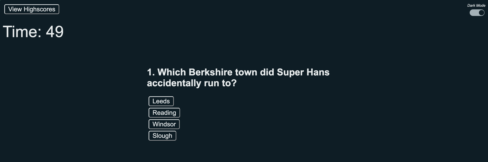
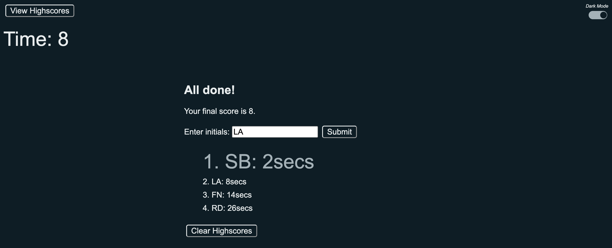
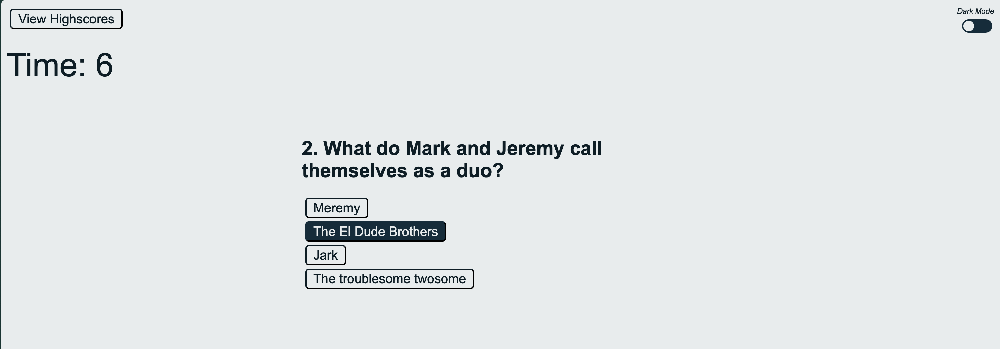

# Peep Show Quiz

## Description

A simple Peep Show quiz featuring mainly Javascript code that displays questions from an array and checks if the right answer is selected.

There is a timer that will record your score. If you select the wrong answer 10 seconds will be added to your score.

Your highscore will be displayed at the end, along with previous attempts stored in local storage (sorted into quickest time first).

There is also a dark mode toggle button that saves your preference to local storage.

## Installation

To view the page visit [fawltya.github.io/peep-show-quiz](https://fawltya.github.io/peep-show-quiz/)

## Usage

Answer the questions correctly to progress through the quiz and put your initals in at the end to log your high score.

## License

MIT License

---